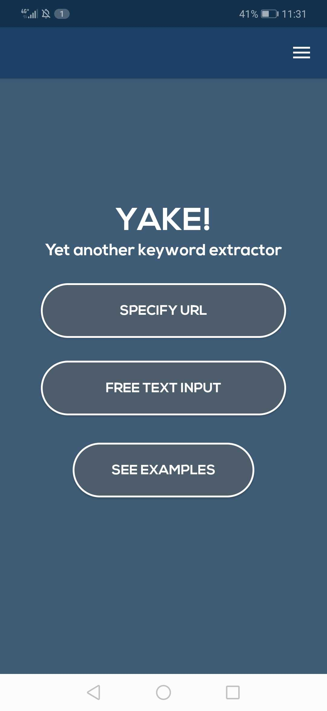
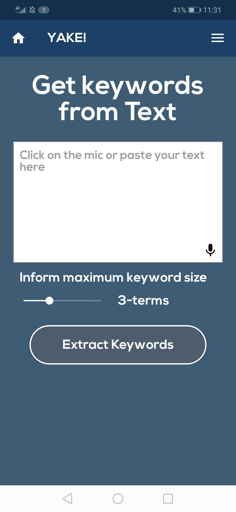
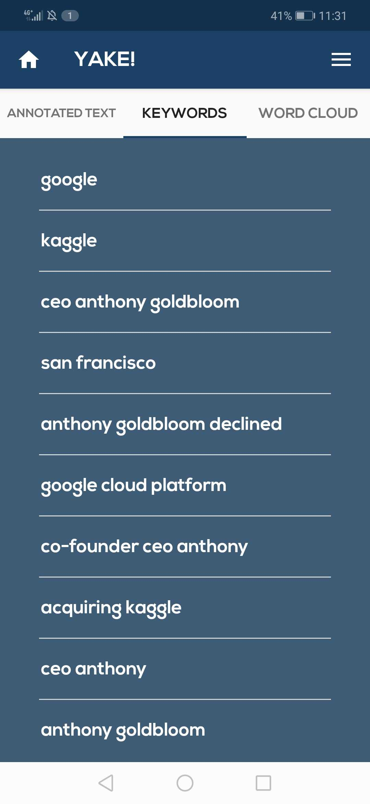
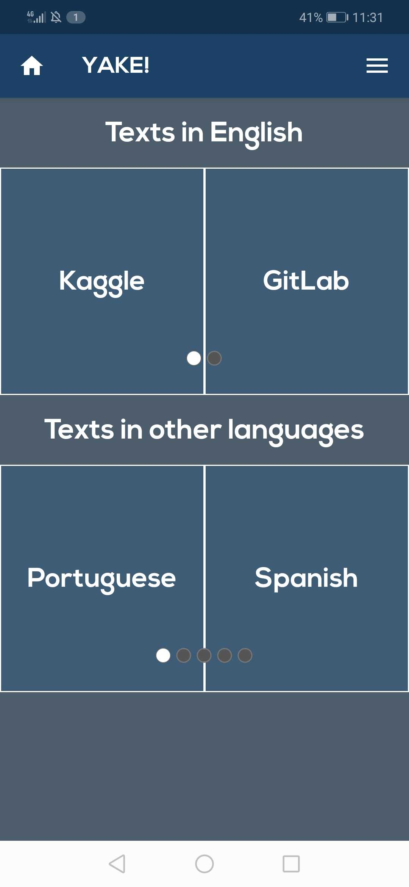
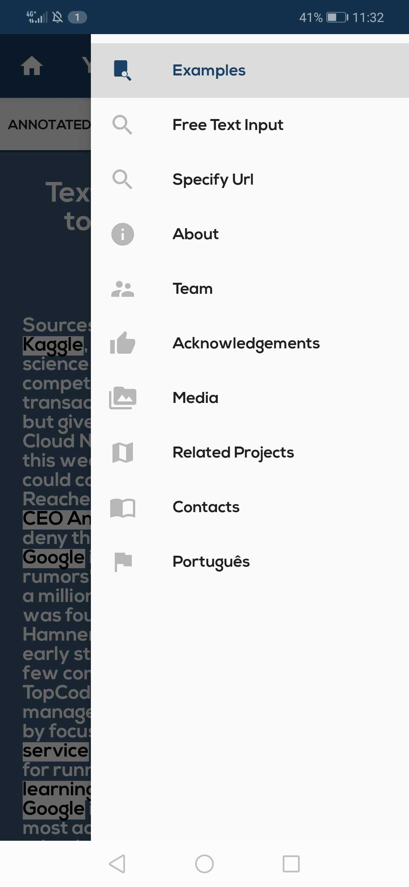
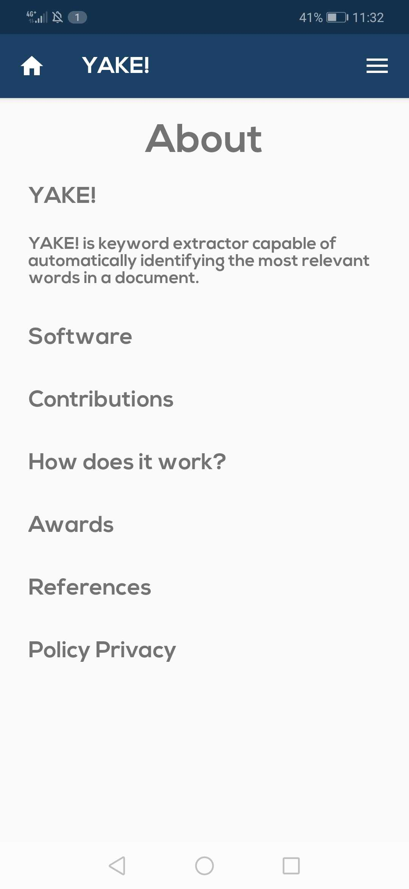

# YAKE

### Application made for android using Kotlin

#### This is an App that uses the [Rick and Morty API](https://rickandmortyapi.com). A lot of info provided by the API is displayed in different ways in this App.
#### A Recycler view is used to display all the Characters, a ViewPager is used to navigate through Views displaying the Characters.
#### There's a profile for each Characters displaying info provided by the API. There's a list of all locations that appear on the show and a Chart View for the number os characters per episode for each season.
#### I made the app with the intention of learning and get better at programming mobile.

### Some images of the App:
|||||

|||||
|||
